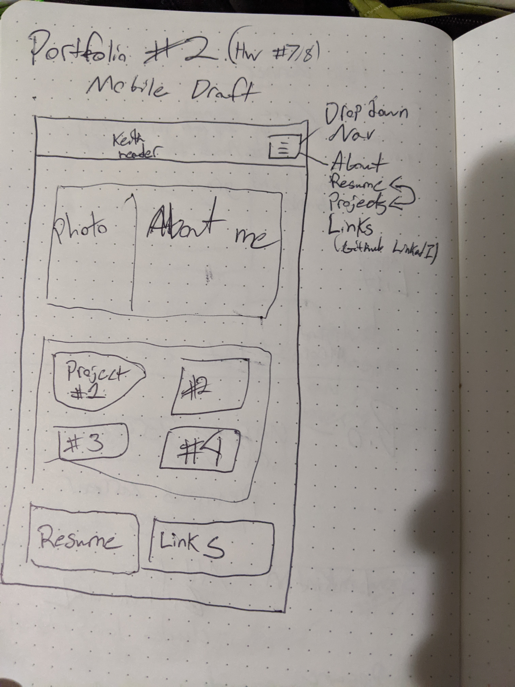
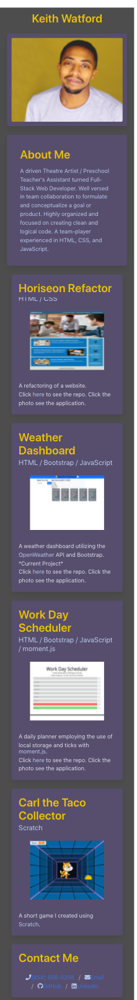
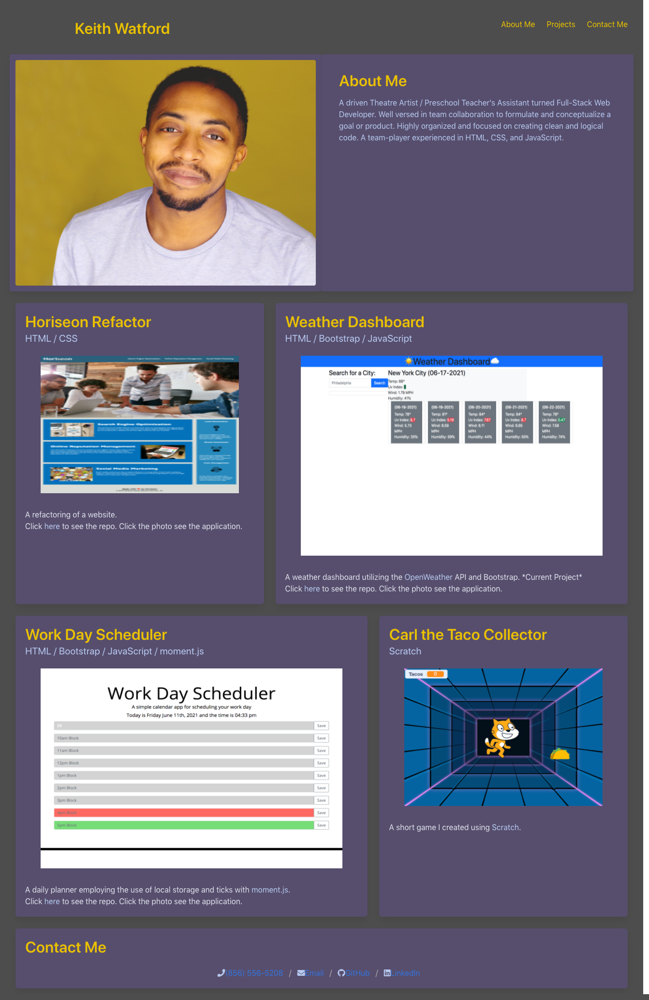

# Portfolio (v2)

## Description
I wanted to create a new portfolio, using some of the new tools Ive learned. I also wanted to challenge myself and work with a new-to-me CSS framework. I decided to use Bulma (https://bulma.io/documentation/). I found it to be very easy to pick up and I was mostly able to create what I originally had in my wireframe.

## Table of Contents (Optional)
- [Installation](#installation)
- [Usage](#usage)
- [Credits](#credits)
- [Notes](#Notes)
- [License](#license)

## Installation
No installs required. Works best in an updated browser.

## Usage
https://keith-l-watford.github.io/who-am-i/
Above is the link to the live application. 

A photo of my original wireframe for this iteration of my portfolio:

Here's a screenshot the mobile version:

Here's a screenshot the desktop version:

## Credits
Shout out to my tutor Scott (https://github.com/smack322) for giving me some early career advice and some tips and tricks for LinkedIn and building a resumé.

## Notes
Im super happy with how this draft turned out. Using Bulma made the process so efficient and easy. The next thing I would like to look into for this project is the white space in the mobile version of the website.

## License
This is free and unencumbered software released into the public domain.

Anyone is free to copy, modify, publish, use, compile, sell, or distribute this software, either in source code form or as a compiled binary, for any purpose, commercial or non-commercial, and by any means.

In jurisdictions that recognize copyright laws, the author or authors of this software dedicate any and all copyright interest in the software to the public domain. We make this dedication for the benefit of the public at large and to the detriment of our heirs and successors. We intend this dedication to be an overt act of relinquishment in perpetuity of all present and future rights to this software under copyright law.

THE SOFTWARE IS PROVIDED "AS IS", WITHOUT WARRANTY OF ANY KIND, EXPRESS OR IMPLIED, INCLUDING BUT NOT LIMITED TO THE WARRANTIES OF MERCHANTABILITY, FITNESS FOR A PARTICULAR PURPOSE AND NONINFRINGEMENT. IN NO EVENT SHALL THE AUTHORS BE LIABLE FOR ANY CLAIM, DAMAGES OR OTHER LIABILITY, WHETHER IN AN ACTION OF CONTRACT, TORT OR OTHERWISE, ARISING FROM, OUT OF OR IN CONNECTION WITH THE SOFTWARE OR THE USE OR OTHER DEALINGS IN THE SOFTWARE.

For more information, please refer to http://unlicense.org/